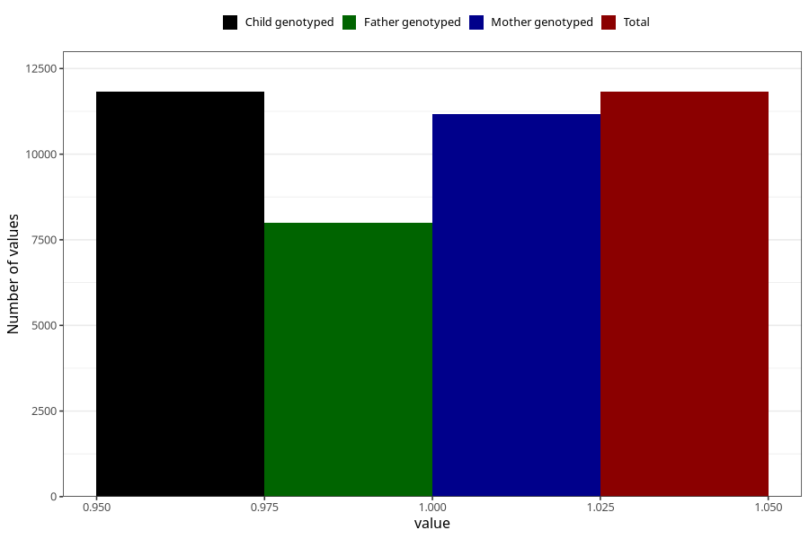

# constipation_17w_20w
Variable mapping to `CC437` in `Skjema3_v12`.
- Number of values:

| Value | Total | Child genotyped | Mother genotyped | Father genotyped |
| ----- | ----- | --------------- | ---------------- | ---------------- |
| Missing | 69184 | 69184 | 65444 | 45604 |
| Non-missing | 11821 | 11821 | 11173 | 8000 |
| 1 | 11821 | 11821 | 11173 | 8000 |

