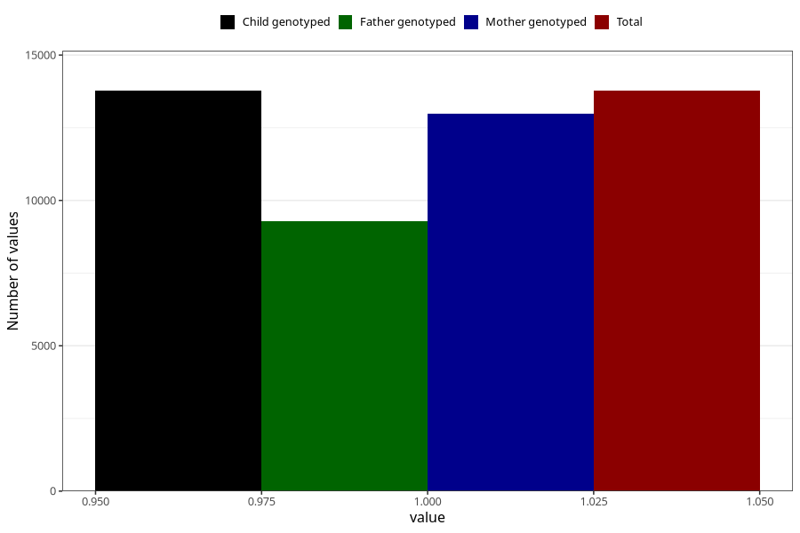

# constipation_21w_24w
Variable mapping to `CC438` in `Skjema3_v12`.
- Number of values:

| Value | Total | Child genotyped | Mother genotyped | Father genotyped |
| ----- | ----- | --------------- | ---------------- | ---------------- |
| Missing | 67233 | 67233 | 63622 | 44307 |
| Non-missing | 13772 | 13772 | 12995 | 9297 |
| 1 | 13772 | 13772 | 12995 | 9297 |

