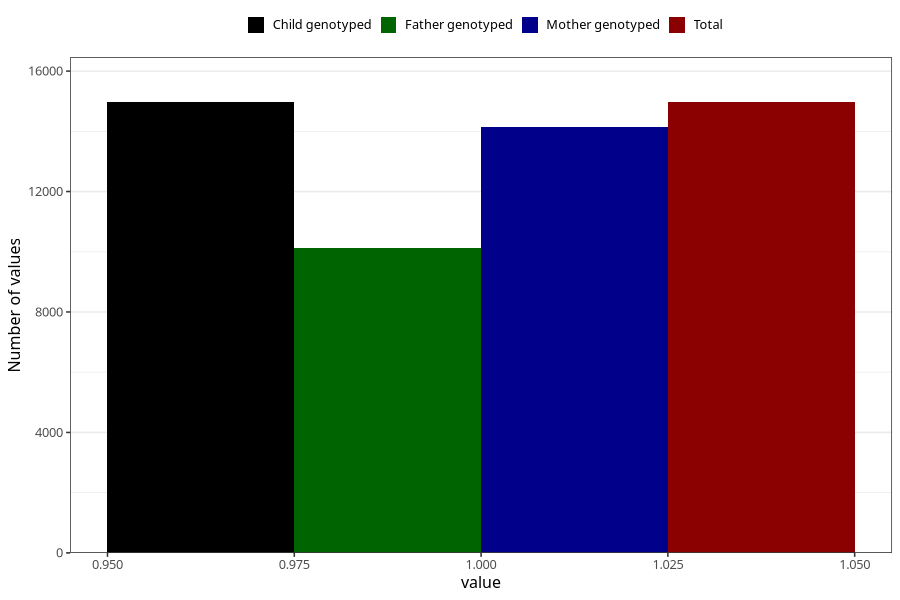

# constipation_25w_28w
Variable mapping to `CC439` in `Skjema3_v12`.
- Number of values:

| Value | Total | Child genotyped | Mother genotyped | Father genotyped |
| ----- | ----- | --------------- | ---------------- | ---------------- |
| Missing | 66038 | 66038 | 62470 | 43471 |
| Non-missing | 14967 | 14967 | 14147 | 10133 |
| 1 | 14967 | 14967 | 14147 | 10133 |

