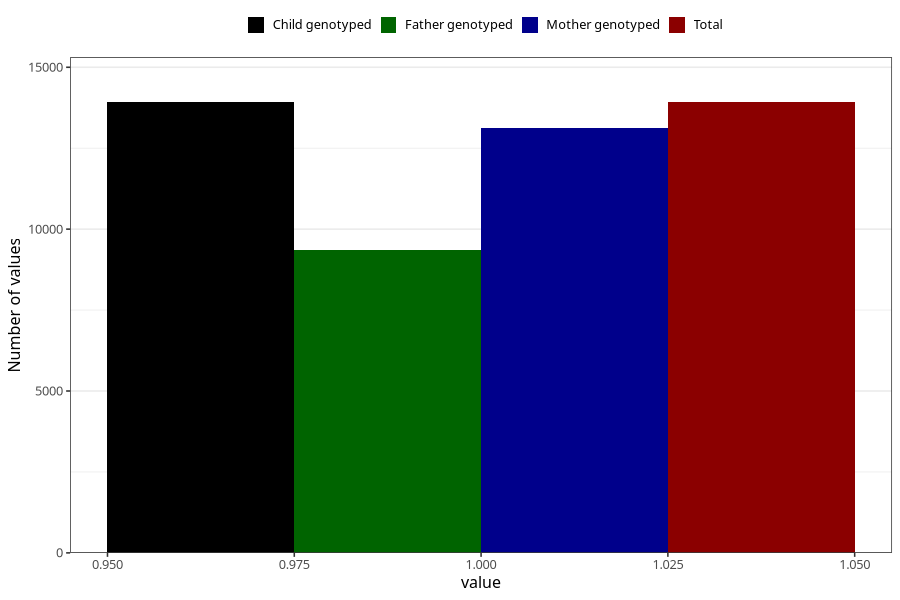

# constipation_5w_8w
Variable mapping to `AA267` in `Skjema1_v12`.
- Number of values:

| Value | Total | Child genotyped | Mother genotyped | Father genotyped |
| ----- | ----- | --------------- | ---------------- | ---------------- |
| Missing | 67084 | 67084 | 63483 | 44263 |
| Non-missing | 13921 | 13921 | 13134 | 9341 |
| 1 | 13921 | 13921 | 13134 | 9341 |

