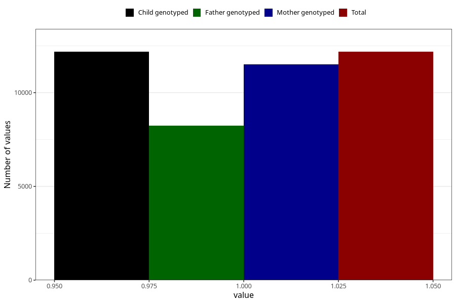

# constipation_after_29w
Variable mapping to `CC440` in `Skjema3_v12`.
- Number of values:

| Value | Total | Child genotyped | Mother genotyped | Father genotyped |
| ----- | ----- | --------------- | ---------------- | ---------------- |
| Missing | 68825 | 68825 | 65106 | 45361 |
| Non-missing | 12180 | 12180 | 11511 | 8243 |
| 1 | 12180 | 12180 | 11511 | 8243 |

