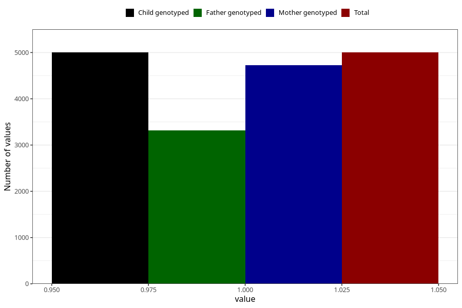

# constipation_before_4w
Variable mapping to `AA266` in `Skjema1_v12`.
- Number of values:

| Value | Total | Child genotyped | Mother genotyped | Father genotyped |
| ----- | ----- | --------------- | ---------------- | ---------------- |
| Missing | 76003 | 76003 | 71894 | 50286 |
| Non-missing | 5002 | 5002 | 4723 | 3318 |
| 1 | 5002 | 5002 | 4723 | 3318 |

