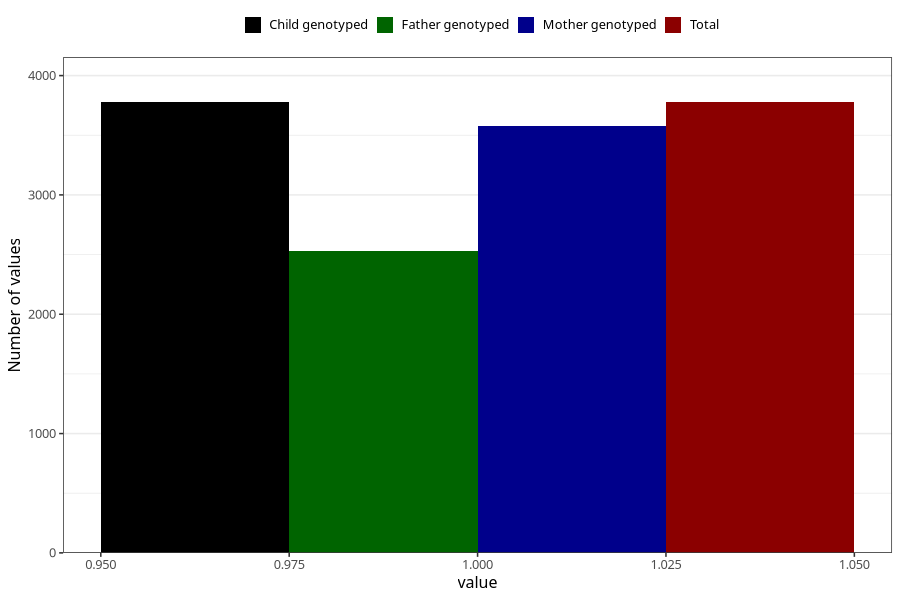

# diarrhoea_13w_15w
Variable mapping to `AA279` in `Skjema1_v12`.
- Number of values:

| Value | Total | Child genotyped | Mother genotyped | Father genotyped |
| ----- | ----- | --------------- | ---------------- | ---------------- |
| Missing | 77228 | 77228 | 73038 | 51072 |
| Non-missing | 3777 | 3777 | 3579 | 2532 |
| 1 | 3777 | 3777 | 3579 | 2532 |

