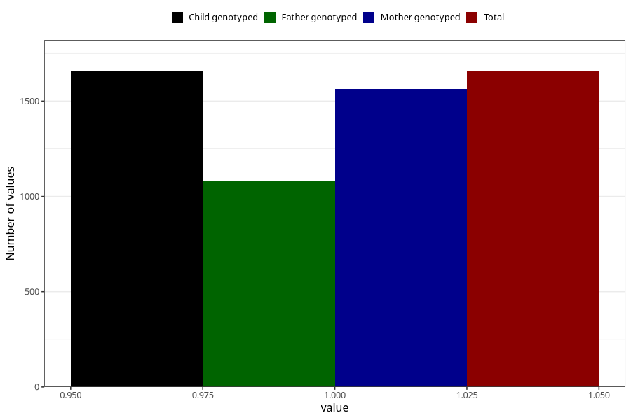

# diarrhoea_13w_16w
Variable mapping to `CC448` in `Skjema3_v12`.
- Number of values:

| Value | Total | Child genotyped | Mother genotyped | Father genotyped |
| ----- | ----- | --------------- | ---------------- | ---------------- |
| Missing | 79350 | 79350 | 75052 | 52520 |
| Non-missing | 1655 | 1655 | 1565 | 1084 |
| 1 | 1655 | 1655 | 1565 | 1084 |

