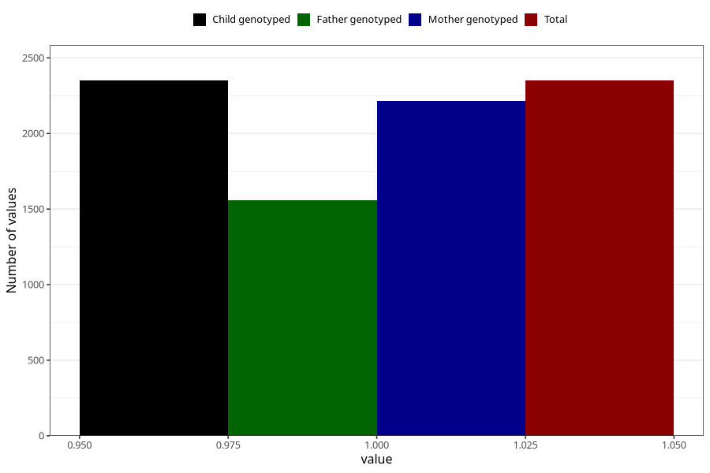

# diarrhoea_21w_24w
Variable mapping to `CC450` in `Skjema3_v12`.
- Number of values:

| Value | Total | Child genotyped | Mother genotyped | Father genotyped |
| ----- | ----- | --------------- | ---------------- | ---------------- |
| Missing | 78655 | 78655 | 74400 | 52044 |
| Non-missing | 2350 | 2350 | 2217 | 1560 |
| 1 | 2350 | 2350 | 2217 | 1560 |

