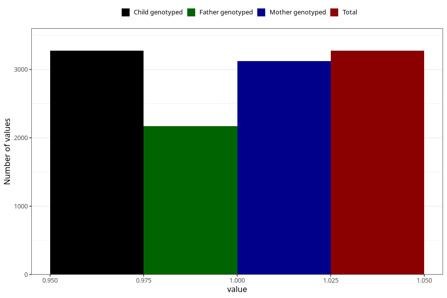

# diarrhoea_25w_28w
Variable mapping to `CC451` in `Skjema3_v12`.
- Number of values:

| Value | Total | Child genotyped | Mother genotyped | Father genotyped |
| ----- | ----- | --------------- | ---------------- | ---------------- |
| Missing | 77732 | 77732 | 73492 | 51434 |
| Non-missing | 3273 | 3273 | 3125 | 2170 |
| 1 | 3273 | 3273 | 3125 | 2170 |

