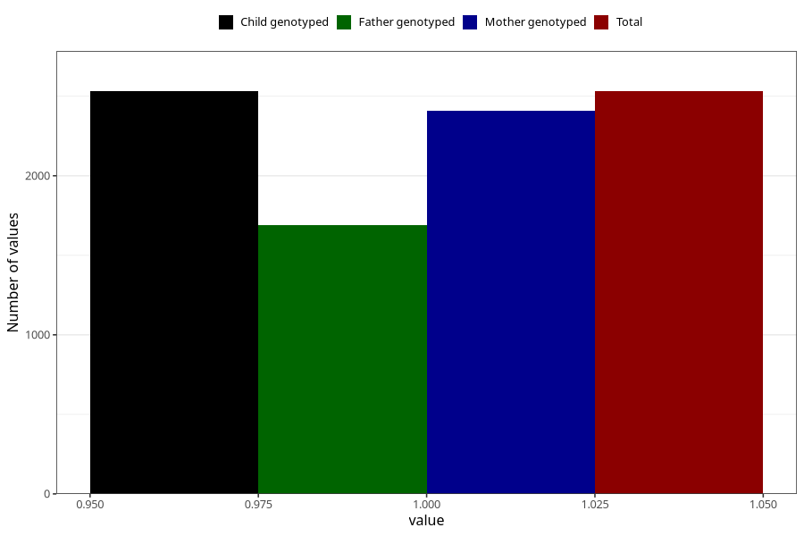

# diarrhoea_5w_8w
Variable mapping to `AA277` in `Skjema1_v12`.
- Number of values:

| Value | Total | Child genotyped | Mother genotyped | Father genotyped |
| ----- | ----- | --------------- | ---------------- | ---------------- |
| Missing | 78474 | 78474 | 74208 | 51912 |
| Non-missing | 2531 | 2531 | 2409 | 1692 |
| 1 | 2531 | 2531 | 2409 | 1692 |

