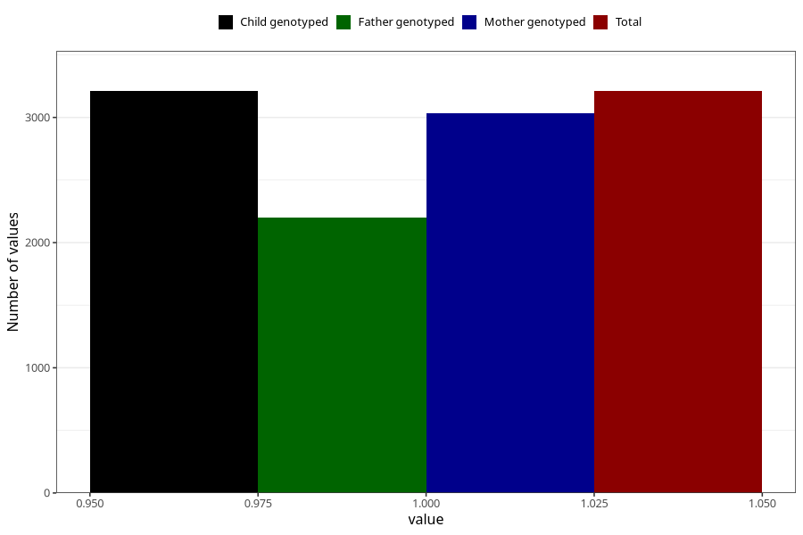

# diarrhoea_9w_12w
Variable mapping to `AA278` in `Skjema1_v12`.
- Number of values:

| Value | Total | Child genotyped | Mother genotyped | Father genotyped |
| ----- | ----- | --------------- | ---------------- | ---------------- |
| Missing | 77795 | 77795 | 73582 | 51401 |
| Non-missing | 3210 | 3210 | 3035 | 2203 |
| 1 | 3210 | 3210 | 3035 | 2203 |

