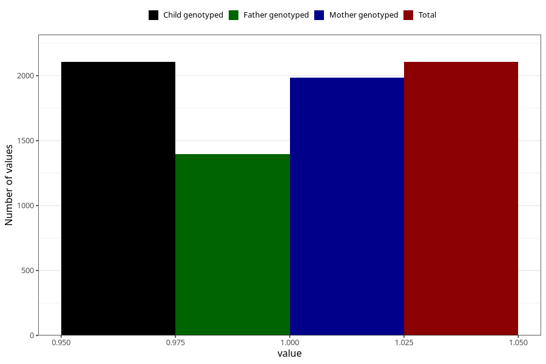

# diarrhoea_after_29w
Variable mapping to `CC452` in `Skjema3_v12`.
- Number of values:

| Value | Total | Child genotyped | Mother genotyped | Father genotyped |
| ----- | ----- | --------------- | ---------------- | ---------------- |
| Missing | 78900 | 78900 | 74633 | 52210 |
| Non-missing | 2105 | 2105 | 1984 | 1394 |
| 1 | 2105 | 2105 | 1984 | 1394 |

