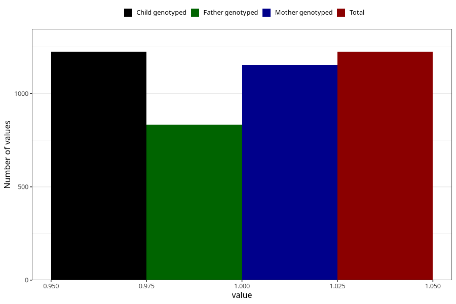

# fever_over385_13w_15w
Variable mapping to `AA339` in `Skjema1_v12`.
- Number of values:

| Value | Total | Child genotyped | Mother genotyped | Father genotyped |
| ----- | ----- | --------------- | ---------------- | ---------------- |
| Missing | 79781 | 79781 | 75463 | 52770 |
| Non-missing | 1224 | 1224 | 1154 | 834 |
| 1 | 1224 | 1224 | 1154 | 834 |

