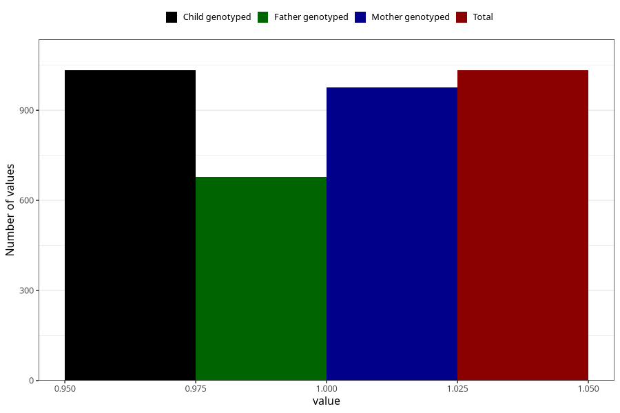

# fever_over385_9w_12w
Variable mapping to `AA338` in `Skjema1_v12`.
- Number of values:

| Value | Total | Child genotyped | Mother genotyped | Father genotyped |
| ----- | ----- | --------------- | ---------------- | ---------------- |
| Missing | 79972 | 79972 | 75642 | 52925 |
| Non-missing | 1033 | 1033 | 975 | 679 |
| 1 | 1033 | 1033 | 975 | 679 |

