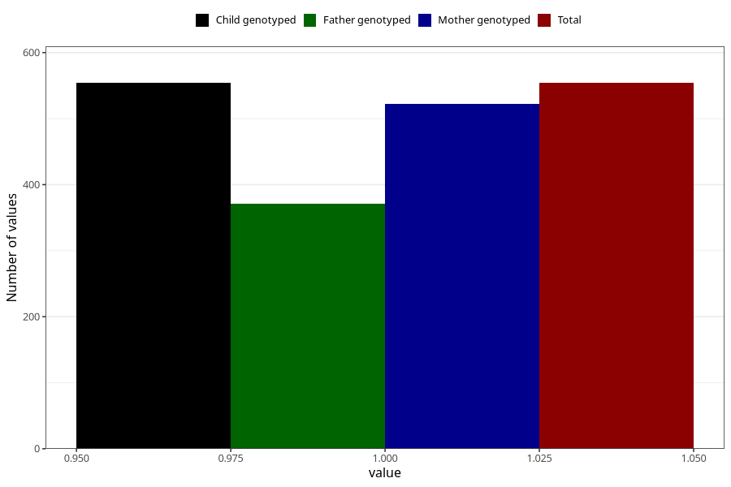

# fever_over385_before_4w
Variable mapping to `AA336` in `Skjema1_v12`.
- Number of values:

| Value | Total | Child genotyped | Mother genotyped | Father genotyped |
| ----- | ----- | --------------- | ---------------- | ---------------- |
| Missing | 80451 | 80451 | 76095 | 53233 |
| Non-missing | 554 | 554 | 522 | 371 |
| 1 | 554 | 554 | 522 | 371 |

