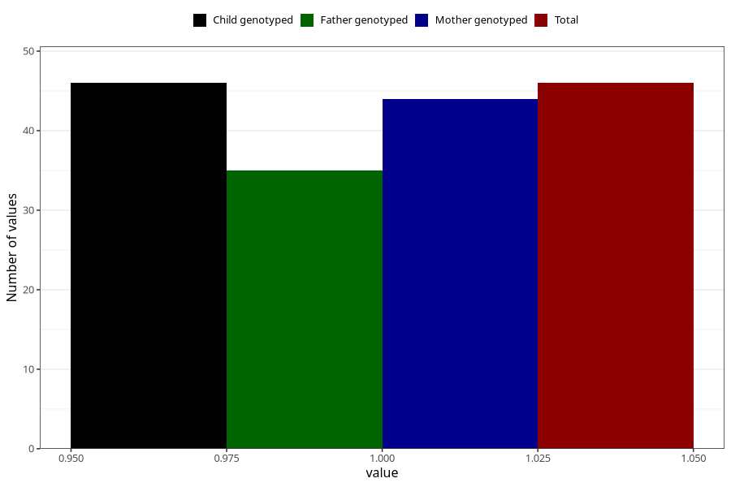

# fever_with_rash_5w_8w
Variable mapping to `AA327` in `Skjema1_v12`.
- Number of values:

| Value | Total | Child genotyped | Mother genotyped | Father genotyped |
| ----- | ----- | --------------- | ---------------- | ---------------- |
| Missing | 80959 | 80959 | 76573 | 53569 |
| Non-missing | 46 | 46 | 44 | 35 |
| 1 | 46 | 46 | 44 | 35 |

