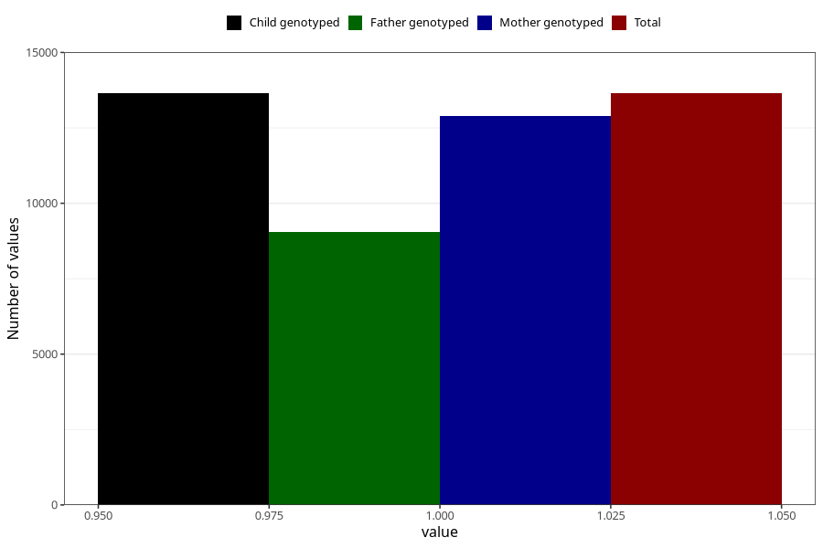

# heartburn_13w_15w
Variable mapping to `AA309` in `Skjema1_v12`.
- Number of values:

| Value | Total | Child genotyped | Mother genotyped | Father genotyped |
| ----- | ----- | --------------- | ---------------- | ---------------- |
| Missing | 67360 | 67360 | 63734 | 44566 |
| Non-missing | 13645 | 13645 | 12883 | 9038 |
| 1 | 13645 | 13645 | 12883 | 9038 |

