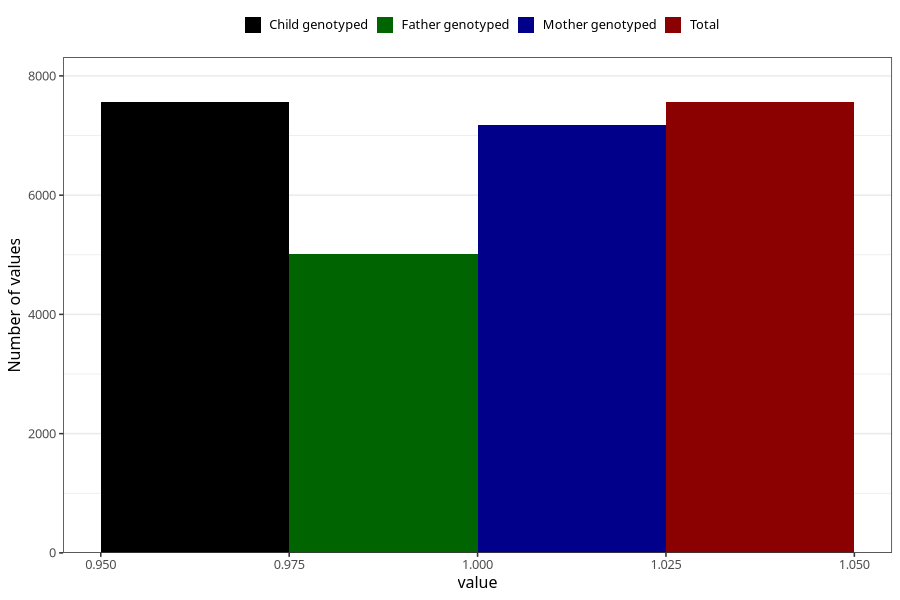

# heartburn_9w_12w
Variable mapping to `AA308` in `Skjema1_v12`.
- Number of values:

| Value | Total | Child genotyped | Mother genotyped | Father genotyped |
| ----- | ----- | --------------- | ---------------- | ---------------- |
| Missing | 73446 | 73446 | 69447 | 48594 |
| Non-missing | 7559 | 7559 | 7170 | 5010 |
| 1 | 7559 | 7559 | 7170 | 5010 |

