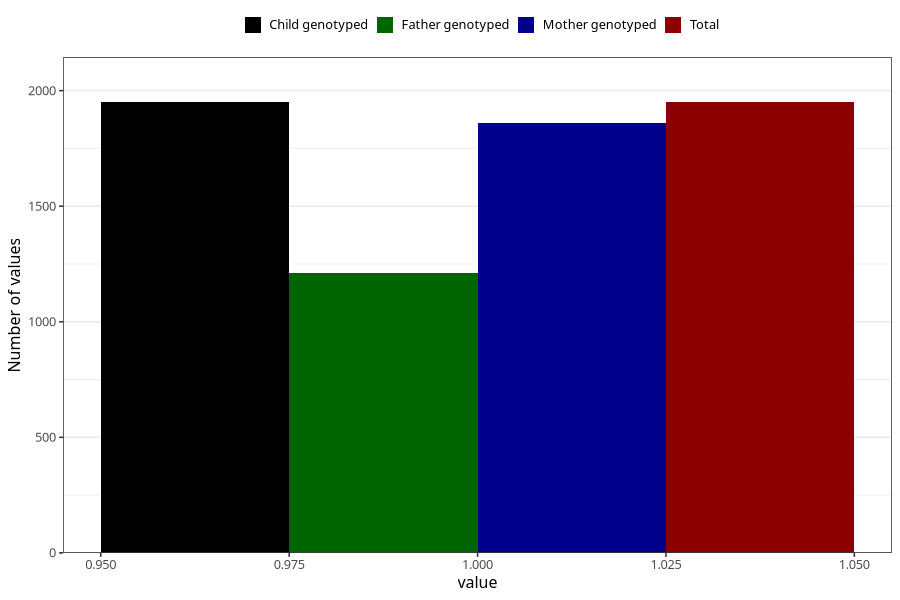

# heartburn_before_4w
Variable mapping to `AA306` in `Skjema1_v12`.
- Number of values:

| Value | Total | Child genotyped | Mother genotyped | Father genotyped |
| ----- | ----- | --------------- | ---------------- | ---------------- |
| Missing | 79055 | 79055 | 74759 | 52391 |
| Non-missing | 1950 | 1950 | 1858 | 1213 |
| 1 | 1950 | 1950 | 1858 | 1213 |

