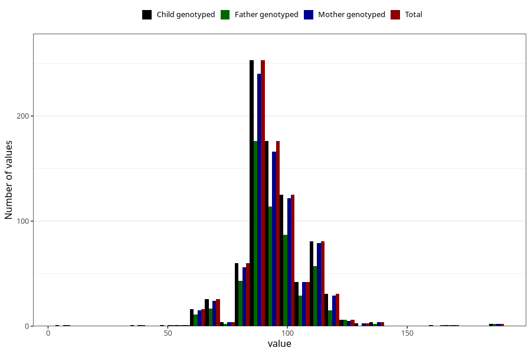

# highest_blood_pressure_before_pregnancy_diastolic
Variable mapping to `CC119` in `Skjema3_v12`.
- Number of values:

| Value | Total | Child genotyped | Mother genotyped | Father genotyped |
| ----- | ----- | --------------- | ---------------- | ---------------- |
| Missing | 80170 | 80170 | 75821 | 53041 |
| Non-missing | 835 | 835 | 796 | 563 |
| 25th percentile | 90 | 90 | 90 | 90 |
| 50th percentile | 95 | 95 | 95 | 95 |
| 75th percentile | 100 | 100 | 100 | 100 |
| Mean | 95.0107784431138 | 95.0107784431138 | 95.0414572864322 | 94.9023090586146 |
| Standard deviation | 13.9871002146579 | 13.9871002146579 | 13.8499429833101 | 13.4676115363883 |
| N | 835 | 835 | 796 | 563 |

