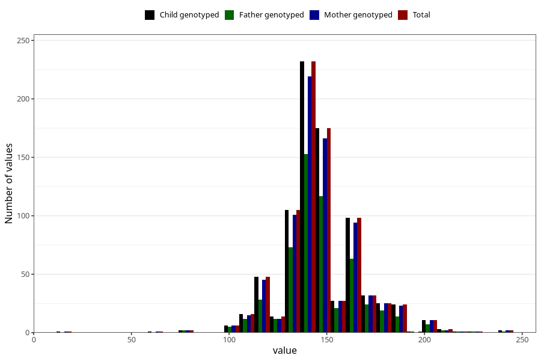

# highest_blood_pressure_before_pregnancy_systolic
Variable mapping to `CC118` in `Skjema3_v12`.
- Number of values:

| Value | Total | Child genotyped | Mother genotyped | Father genotyped |
| ----- | ----- | --------------- | ---------------- | ---------------- |
| Missing | 80180 | 80180 | 75831 | 53048 |
| Non-missing | 825 | 825 | 786 | 556 |
| 25th percentile | 140 | 140 | 140 | 140 |
| 50th percentile | 140 | 140 | 140 | 140 |
| 75th percentile | 155 | 155 | 155 | 155 |
| Mean | 146.173333333333 | 146.173333333333 | 146.269720101781 | 146.374100719424 |
| Standard deviation | 20.0353514429711 | 20.0353514429711 | 20.057141915846 | 19.5250906747319 |
| N | 825 | 825 | 786 | 556 |

