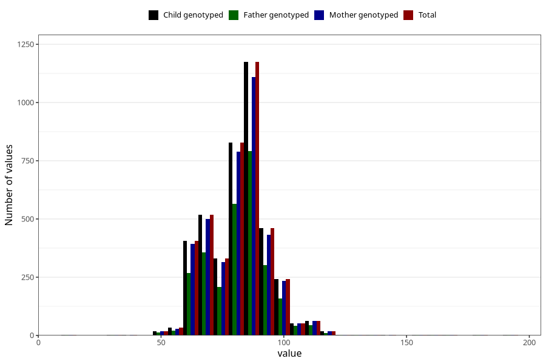

# highest_blood_pressure_during_pregnancy_30w_diastolic
Variable mapping to `CC115` in `Skjema3_v12`.
- Number of values:

| Value | Total | Child genotyped | Mother genotyped | Father genotyped |
| ----- | ----- | --------------- | ---------------- | ---------------- |
| Missing | 76840 | 76840 | 72649 | 50812 |
| Non-missing | 4165 | 4165 | 3968 | 2792 |
| 25th percentile | 74 | 74 | 74 | 74 |
| 50th percentile | 82 | 82 | 82 | 82 |
| 75th percentile | 90 | 90 | 90 | 90 |
| Mean | 82.3166866746699 | 82.3166866746699 | 82.3011592741936 | 82.384670487106 |
| Standard deviation | 12.9348408623946 | 12.9348408623946 | 13.0069799053611 | 13.012670063889 |
| N | 4165 | 4165 | 3968 | 2792 |

