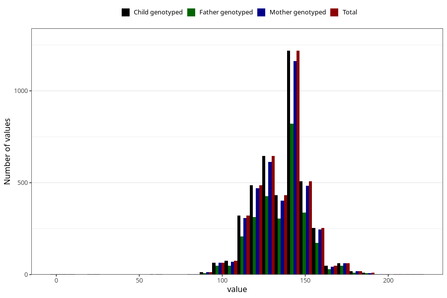

# highest_blood_pressure_during_pregnancy_30w_systolic
Variable mapping to `CC114` in `Skjema3_v12`.
- Number of values:

| Value | Total | Child genotyped | Mother genotyped | Father genotyped |
| ----- | ----- | --------------- | ---------------- | ---------------- |
| Missing | 76834 | 76834 | 72644 | 50807 |
| Non-missing | 4171 | 4171 | 3973 | 2797 |
| 25th percentile | 125 | 125 | 125 | 125 |
| 50th percentile | 140 | 140 | 140 | 140 |
| 75th percentile | 145 | 145 | 145 | 145 |
| Mean | 135.774154878926 | 135.774154878926 | 135.730178706267 | 135.88630675724 |
| Standard deviation | 16.1893269004809 | 16.1893269004809 | 16.2246684700185 | 16.3029685364485 |
| N | 4171 | 4171 | 3973 | 2797 |

