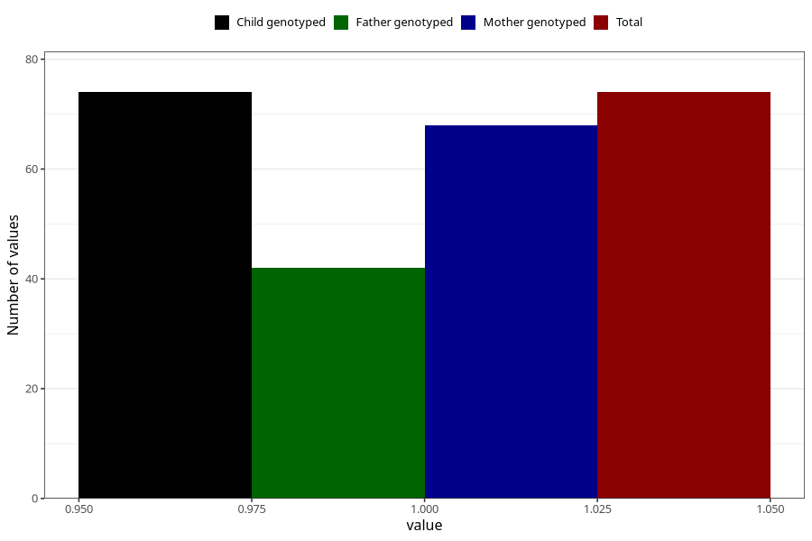

# hospitalized_amniotic_fluid_leakage
Variable mapping to `CC155` in `Skjema3_v12`.
- Number of values:

| Value | Total | Child genotyped | Mother genotyped | Father genotyped |
| ----- | ----- | --------------- | ---------------- | ---------------- |
| Missing | 80931 | 80931 | 76549 | 53562 |
| Non-missing | 74 | 74 | 68 | 42 |
| 1 | 74 | 74 | 68 | 42 |

