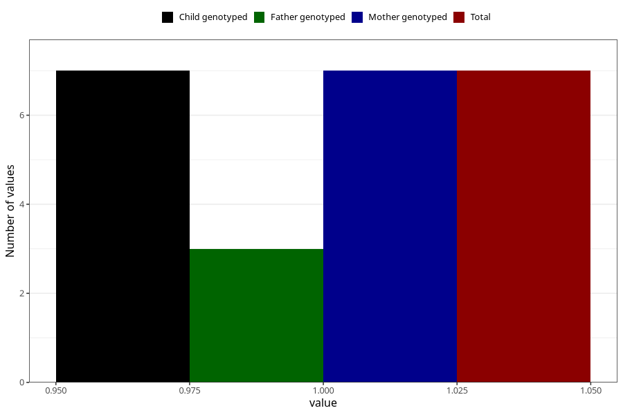

# hospitalized_amniotic_fluid_leakage_21_24w
Variable mapping to `CC161` in `Skjema3_v12`.
- Number of values:

| Value | Total | Child genotyped | Mother genotyped | Father genotyped |
| ----- | ----- | --------------- | ---------------- | ---------------- |
| Missing | 80998 | 80998 | 76610 | 53601 |
| Non-missing | 7 | 7 | 7 | 3 |
| 1 | 7 | 7 | 7 | 3 |

