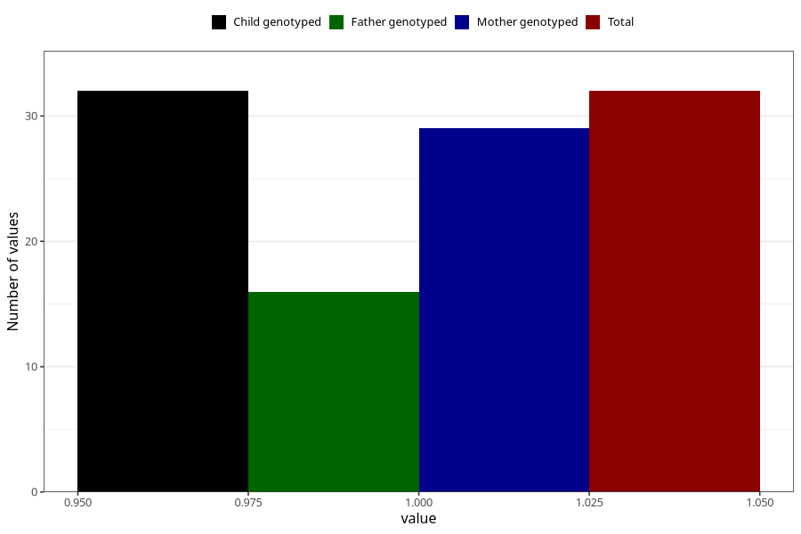

# hospitalized_amniotic_fluid_leakage_25_28w
Variable mapping to `CC162` in `Skjema3_v12`.
- Number of values:

| Value | Total | Child genotyped | Mother genotyped | Father genotyped |
| ----- | ----- | --------------- | ---------------- | ---------------- |
| Missing | 80973 | 80973 | 76588 | 53588 |
| Non-missing | 32 | 32 | 29 | 16 |
| 1 | 32 | 32 | 29 | 16 |

