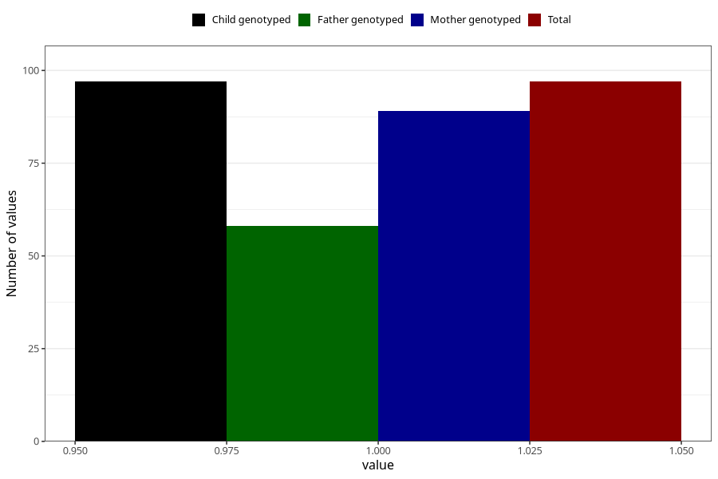

# hospitalized_bleeding_13_16w
Variable mapping to `CC150` in `Skjema3_v12`.
- Number of values:

| Value | Total | Child genotyped | Mother genotyped | Father genotyped |
| ----- | ----- | --------------- | ---------------- | ---------------- |
| Missing | 80908 | 80908 | 76528 | 53546 |
| Non-missing | 97 | 97 | 89 | 58 |
| 1 | 97 | 97 | 89 | 58 |

