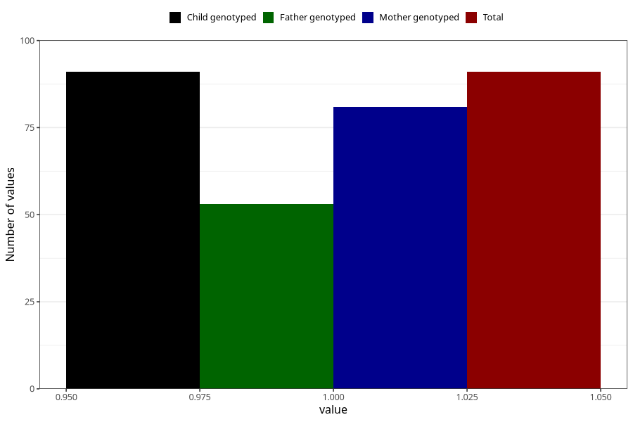

# hospitalized_bleeding_21_24w
Variable mapping to `CC152` in `Skjema3_v12`.
- Number of values:

| Value | Total | Child genotyped | Mother genotyped | Father genotyped |
| ----- | ----- | --------------- | ---------------- | ---------------- |
| Missing | 80914 | 80914 | 76536 | 53551 |
| Non-missing | 91 | 91 | 81 | 53 |
| 1 | 91 | 91 | 81 | 53 |

