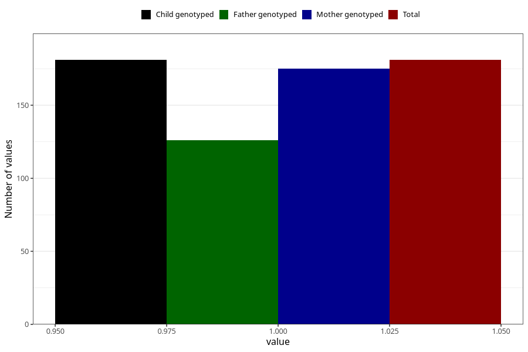

# hospitalized_bleeding_25_28w
Variable mapping to `CC153` in `Skjema3_v12`.
- Number of values:

| Value | Total | Child genotyped | Mother genotyped | Father genotyped |
| ----- | ----- | --------------- | ---------------- | ---------------- |
| Missing | 80824 | 80824 | 76442 | 53478 |
| Non-missing | 181 | 181 | 175 | 126 |
| 1 | 181 | 181 | 175 | 126 |

