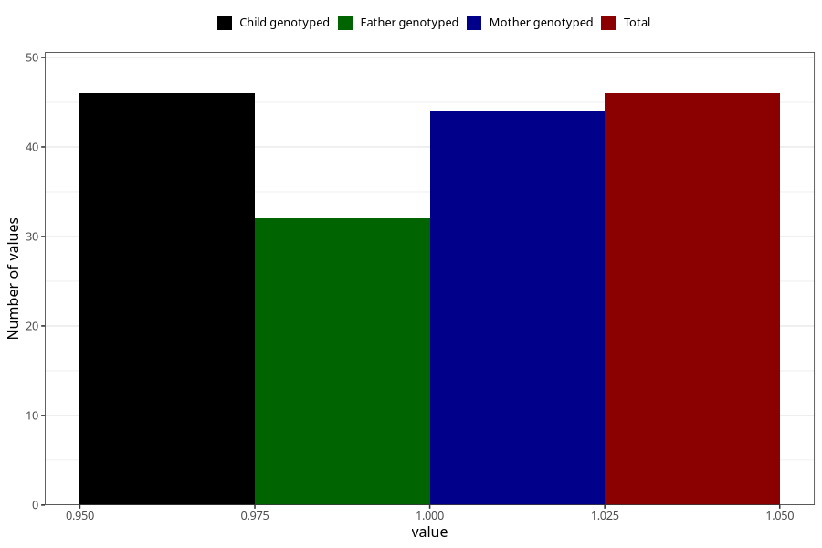

# hospitalized_bleeding_5_8w
Variable mapping to `CC148` in `Skjema3_v12`.
- Number of values:

| Value | Total | Child genotyped | Mother genotyped | Father genotyped |
| ----- | ----- | --------------- | ---------------- | ---------------- |
| Missing | 80959 | 80959 | 76573 | 53572 |
| Non-missing | 46 | 46 | 44 | 32 |
| 1 | 46 | 46 | 44 | 32 |

