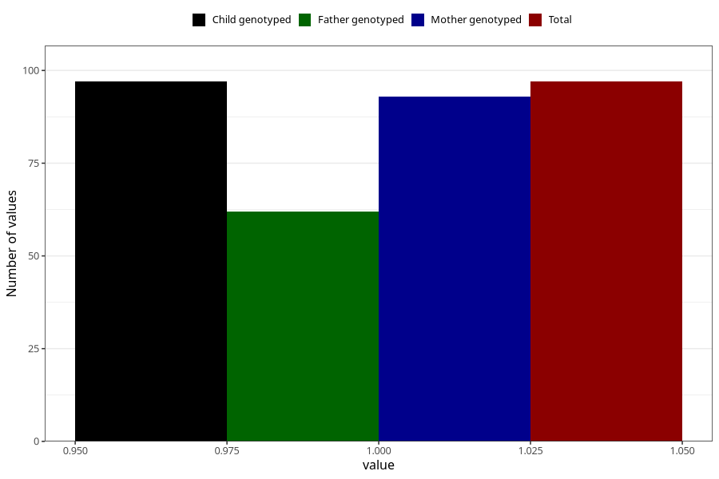

# hospitalized_high_blood_pressure
Variable mapping to `CC173` in `Skjema3_v12`.
- Number of values:

| Value | Total | Child genotyped | Mother genotyped | Father genotyped |
| ----- | ----- | --------------- | ---------------- | ---------------- |
| Missing | 80908 | 80908 | 76524 | 53542 |
| Non-missing | 97 | 97 | 93 | 62 |
| 1 | 97 | 97 | 93 | 62 |

