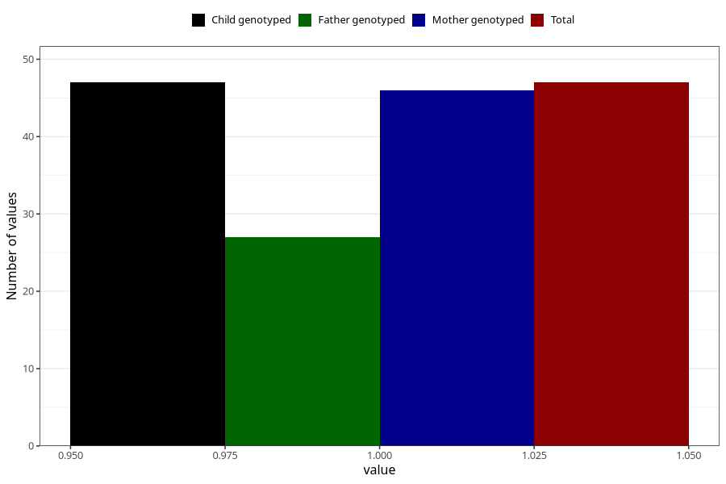

# hospitalized_high_blood_pressure_after_29w
Variable mapping to `CC181` in `Skjema3_v12`.
- Number of values:

| Value | Total | Child genotyped | Mother genotyped | Father genotyped |
| ----- | ----- | --------------- | ---------------- | ---------------- |
| Missing | 80958 | 80958 | 76571 | 53577 |
| Non-missing | 47 | 47 | 46 | 27 |
| 1 | 47 | 47 | 46 | 27 |

