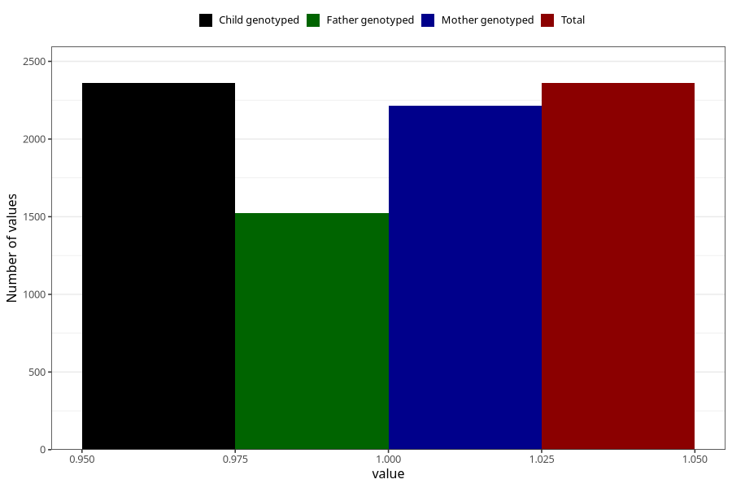

# hospitalized_other
Variable mapping to `CC191` in `Skjema3_v12`.
- Number of values:

| Value | Total | Child genotyped | Mother genotyped | Father genotyped |
| ----- | ----- | --------------- | ---------------- | ---------------- |
| Missing | 78645 | 78645 | 74405 | 52082 |
| Non-missing | 2360 | 2360 | 2212 | 1522 |
| 1 | 2360 | 2360 | 2212 | 1522 |

