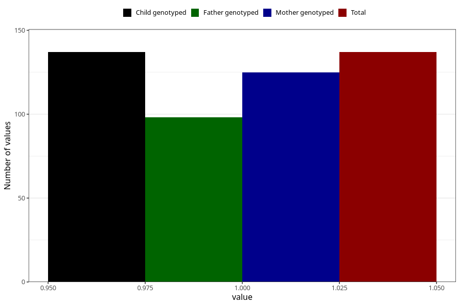

# hospitalized_other_0_4w
Variable mapping to `CC192` in `Skjema3_v12`.
- Number of values:

| Value | Total | Child genotyped | Mother genotyped | Father genotyped |
| ----- | ----- | --------------- | ---------------- | ---------------- |
| Missing | 80868 | 80868 | 76492 | 53506 |
| Non-missing | 137 | 137 | 125 | 98 |
| 1 | 137 | 137 | 125 | 98 |

