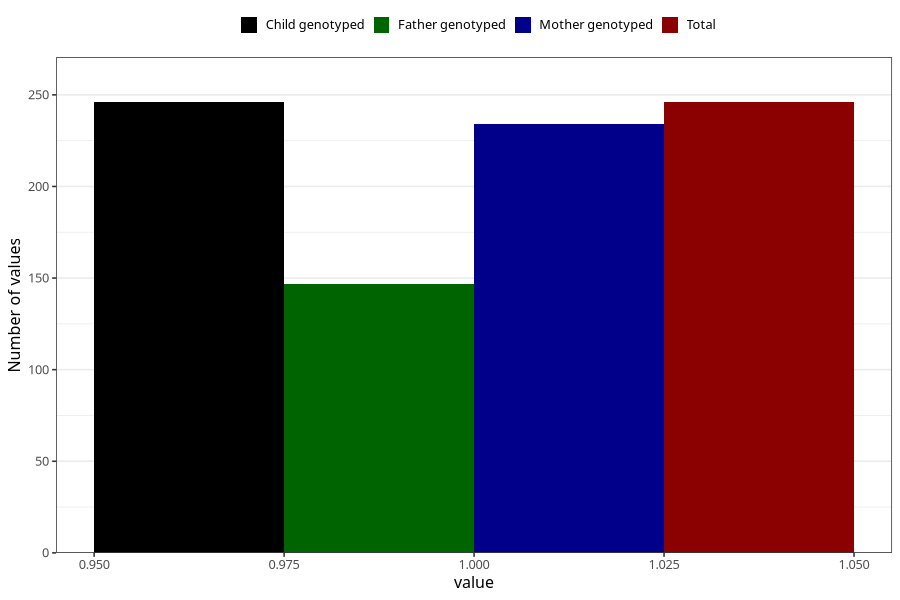

# hospitalized_other_13_16w
Variable mapping to `CC195` in `Skjema3_v12`.
- Number of values:

| Value | Total | Child genotyped | Mother genotyped | Father genotyped |
| ----- | ----- | --------------- | ---------------- | ---------------- |
| Missing | 80759 | 80759 | 76383 | 53457 |
| Non-missing | 246 | 246 | 234 | 147 |
| 1 | 246 | 246 | 234 | 147 |

