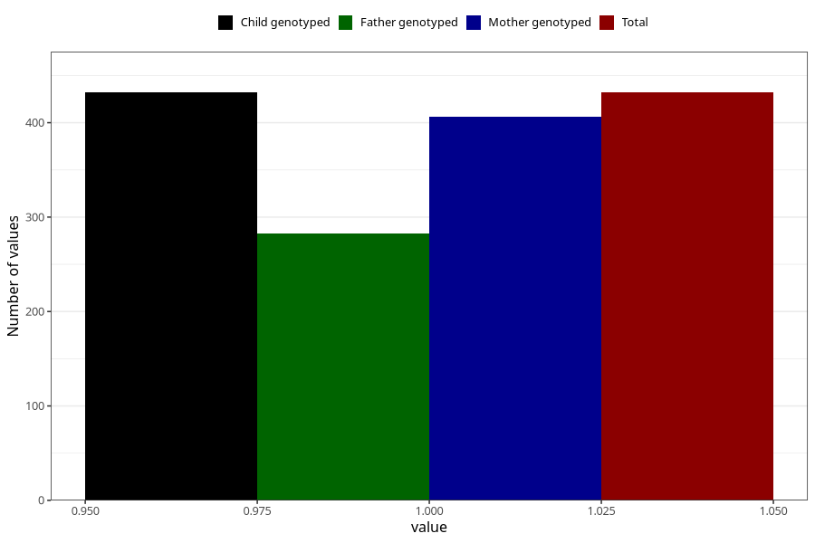

# hospitalized_other_21_24w
Variable mapping to `CC197` in `Skjema3_v12`.
- Number of values:

| Value | Total | Child genotyped | Mother genotyped | Father genotyped |
| ----- | ----- | --------------- | ---------------- | ---------------- |
| Missing | 80573 | 80573 | 76211 | 53321 |
| Non-missing | 432 | 432 | 406 | 283 |
| 1 | 432 | 432 | 406 | 283 |

