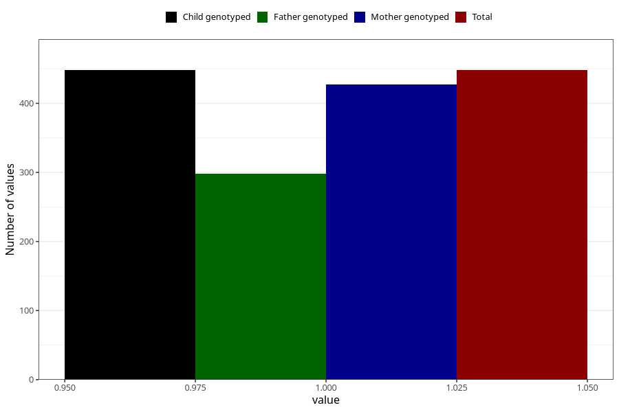

# hospitalized_other_after_29w
Variable mapping to `CC199` in `Skjema3_v12`.
- Number of values:

| Value | Total | Child genotyped | Mother genotyped | Father genotyped |
| ----- | ----- | --------------- | ---------------- | ---------------- |
| Missing | 80557 | 80557 | 76190 | 53306 |
| Non-missing | 448 | 448 | 427 | 298 |
| 1 | 448 | 448 | 427 | 298 |

