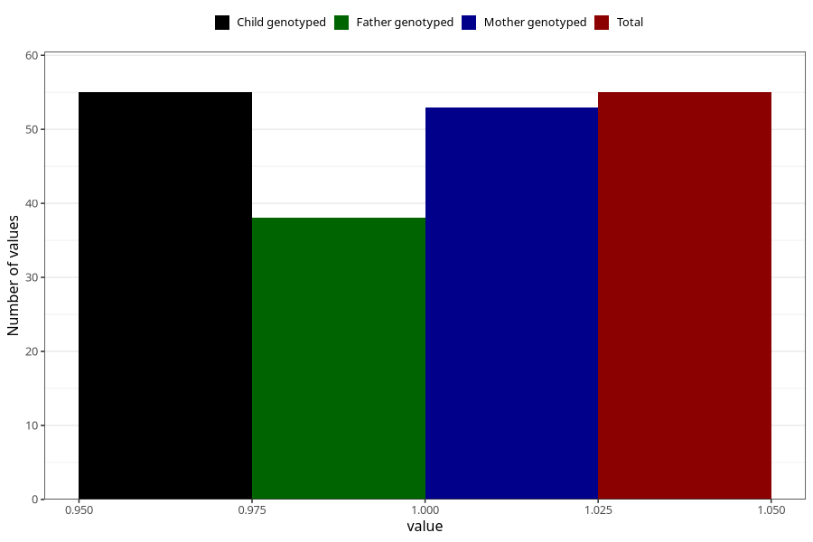

# hospitalized_pre_eclampsia
Variable mapping to `CC182` in `Skjema3_v12`.
- Number of values:

| Value | Total | Child genotyped | Mother genotyped | Father genotyped |
| ----- | ----- | --------------- | ---------------- | ---------------- |
| Missing | 80950 | 80950 | 76564 | 53566 |
| Non-missing | 55 | 55 | 53 | 38 |
| 1 | 55 | 55 | 53 | 38 |

