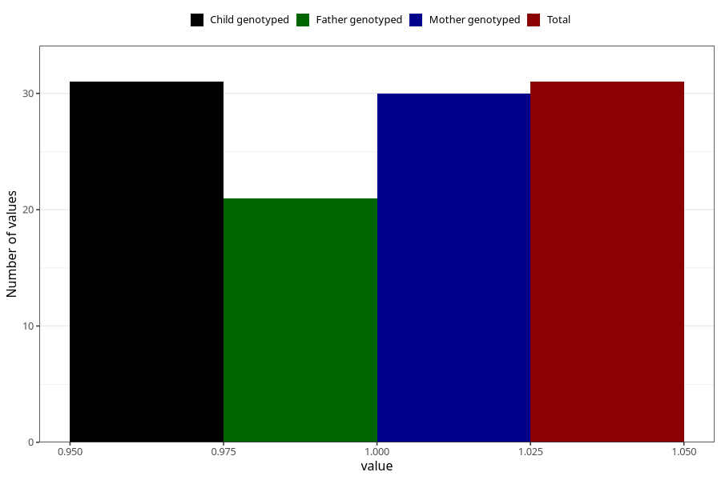

# hospitalized_pre_eclampsia_after_29w
Variable mapping to `CC190` in `Skjema3_v12`.
- Number of values:

| Value | Total | Child genotyped | Mother genotyped | Father genotyped |
| ----- | ----- | --------------- | ---------------- | ---------------- |
| Missing | 80974 | 80974 | 76587 | 53583 |
| Non-missing | 31 | 31 | 30 | 21 |
| 1 | 31 | 31 | 30 | 21 |

