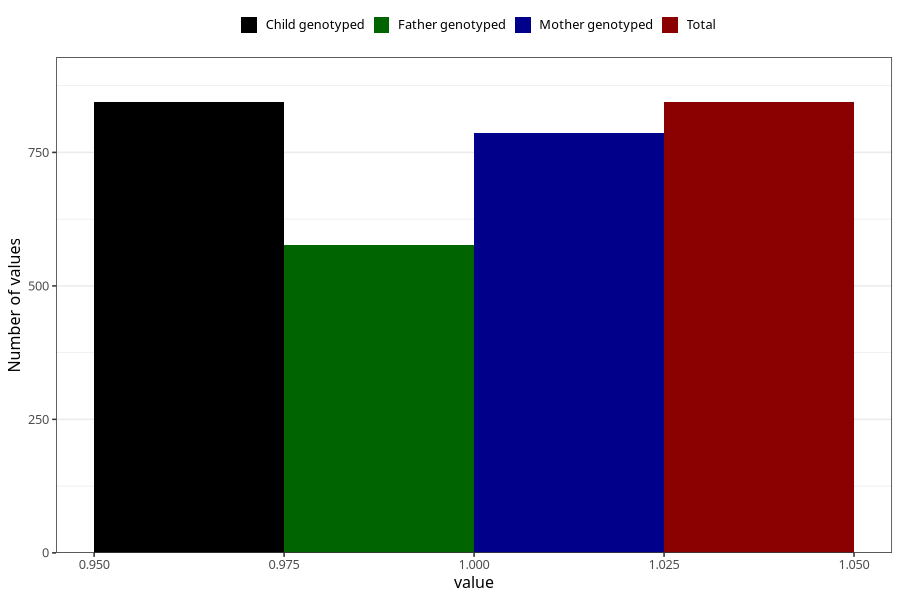

# hospitalized_prolonged_nausea_vomiting
Variable mapping to `CC137` in `Skjema3_v12`.
- Number of values:

| Value | Total | Child genotyped | Mother genotyped | Father genotyped |
| ----- | ----- | --------------- | ---------------- | ---------------- |
| Missing | 80161 | 80161 | 75831 | 53027 |
| Non-missing | 844 | 844 | 786 | 577 |
| 1 | 844 | 844 | 786 | 577 |

