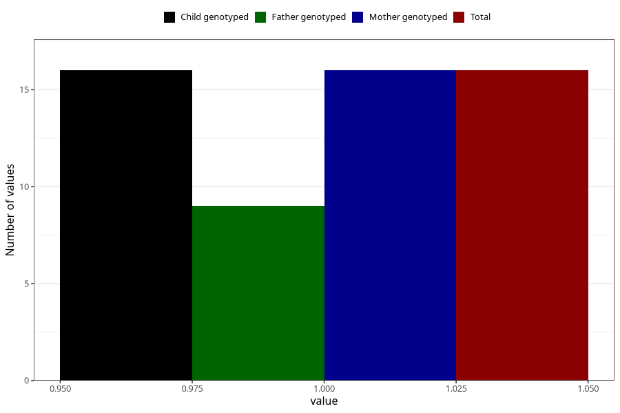

# hospitalized_prolonged_nausea_vomiting_0_4w
Variable mapping to `CC138` in `Skjema3_v12`.
- Number of values:

| Value | Total | Child genotyped | Mother genotyped | Father genotyped |
| ----- | ----- | --------------- | ---------------- | ---------------- |
| Missing | 80989 | 80989 | 76601 | 53595 |
| Non-missing | 16 | 16 | 16 | 9 |
| 1 | 16 | 16 | 16 | 9 |

