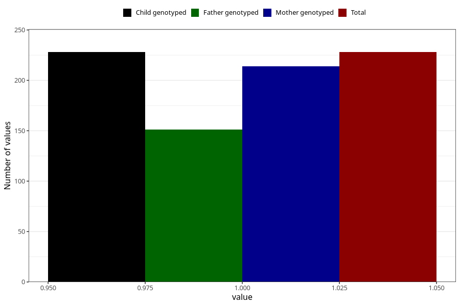

# hospitalized_prolonged_nausea_vomiting_13_16w
Variable mapping to `CC141` in `Skjema3_v12`.
- Number of values:

| Value | Total | Child genotyped | Mother genotyped | Father genotyped |
| ----- | ----- | --------------- | ---------------- | ---------------- |
| Missing | 80777 | 80777 | 76403 | 53453 |
| Non-missing | 228 | 228 | 214 | 151 |
| 1 | 228 | 228 | 214 | 151 |

