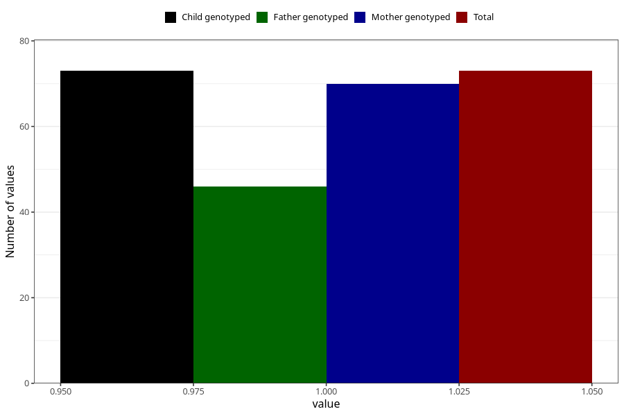

# hospitalized_prolonged_nausea_vomiting_17_20w
Variable mapping to `CC142` in `Skjema3_v12`.
- Number of values:

| Value | Total | Child genotyped | Mother genotyped | Father genotyped |
| ----- | ----- | --------------- | ---------------- | ---------------- |
| Missing | 80932 | 80932 | 76547 | 53558 |
| Non-missing | 73 | 73 | 70 | 46 |
| 1 | 73 | 73 | 70 | 46 |

