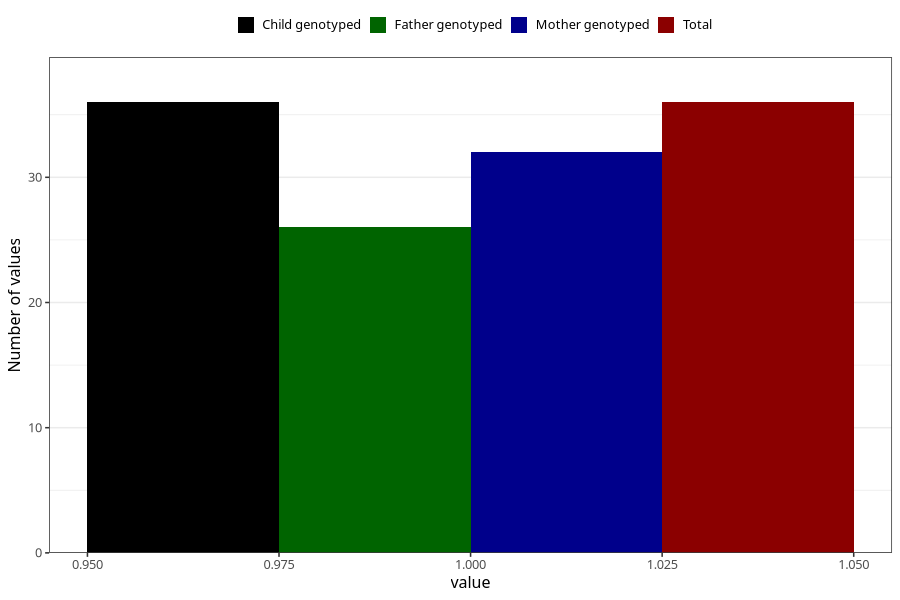

# hospitalized_prolonged_nausea_vomiting_21_24w
Variable mapping to `CC143` in `Skjema3_v12`.
- Number of values:

| Value | Total | Child genotyped | Mother genotyped | Father genotyped |
| ----- | ----- | --------------- | ---------------- | ---------------- |
| Missing | 80969 | 80969 | 76585 | 53578 |
| Non-missing | 36 | 36 | 32 | 26 |
| 1 | 36 | 36 | 32 | 26 |

