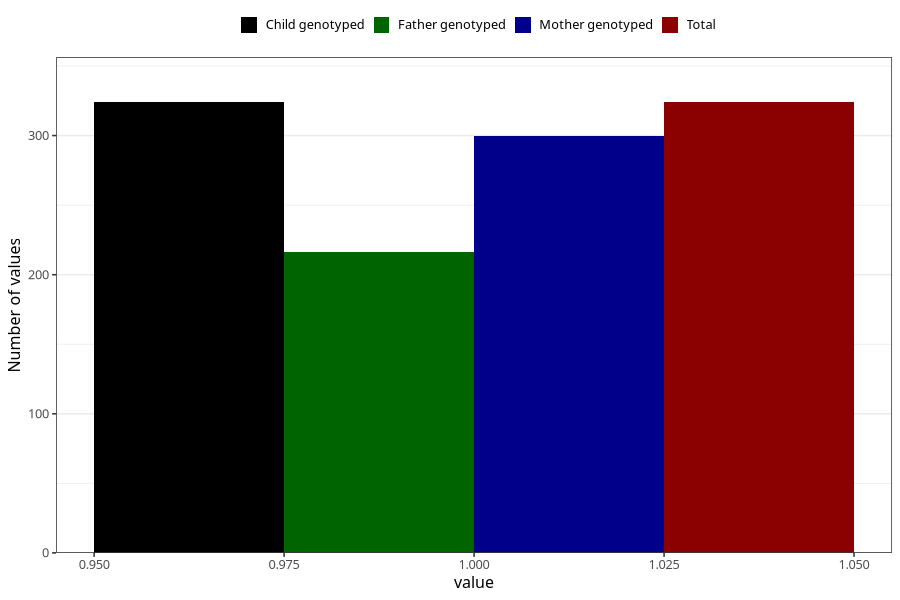

# hospitalized_prolonged_nausea_vomiting_5_8w
Variable mapping to `CC139` in `Skjema3_v12`.
- Number of values:

| Value | Total | Child genotyped | Mother genotyped | Father genotyped |
| ----- | ----- | --------------- | ---------------- | ---------------- |
| Missing | 80681 | 80681 | 76317 | 53388 |
| Non-missing | 324 | 324 | 300 | 216 |
| 1 | 324 | 324 | 300 | 216 |

