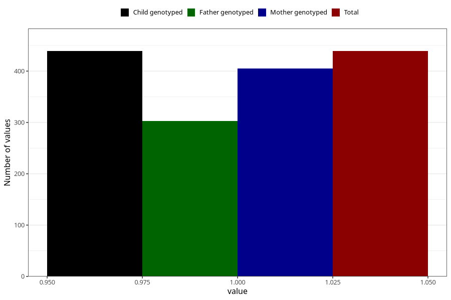

# hospitalized_prolonged_nausea_vomiting_9_12w
Variable mapping to `CC140` in `Skjema3_v12`.
- Number of values:

| Value | Total | Child genotyped | Mother genotyped | Father genotyped |
| ----- | ----- | --------------- | ---------------- | ---------------- |
| Missing | 80566 | 80566 | 76212 | 53301 |
| Non-missing | 439 | 439 | 405 | 303 |
| 1 | 439 | 439 | 405 | 303 |

