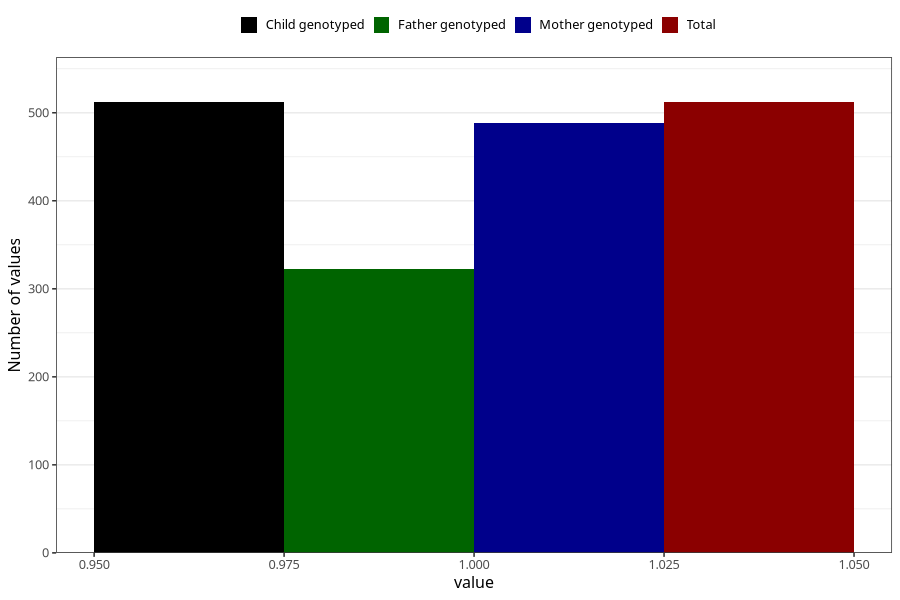

# hospitalized_threatening_preterm_labour
Variable mapping to `CC164` in `Skjema3_v12`.
- Number of values:

| Value | Total | Child genotyped | Mother genotyped | Father genotyped |
| ----- | ----- | --------------- | ---------------- | ---------------- |
| Missing | 80493 | 80493 | 76129 | 53281 |
| Non-missing | 512 | 512 | 488 | 323 |
| 1 | 512 | 512 | 488 | 323 |

