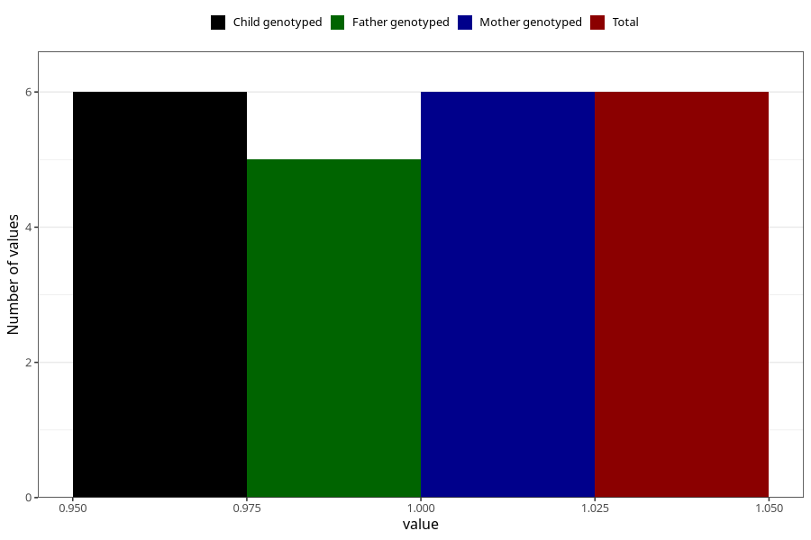

# hospitalized_threatening_preterm_labour_13_16w
Variable mapping to `CC168` in `Skjema3_v12`.
- Number of values:

| Value | Total | Child genotyped | Mother genotyped | Father genotyped |
| ----- | ----- | --------------- | ---------------- | ---------------- |
| Missing | 80999 | 80999 | 76611 | 53599 |
| Non-missing | 6 | 6 | 6 | 5 |
| 1 | 6 | 6 | 6 | 5 |

