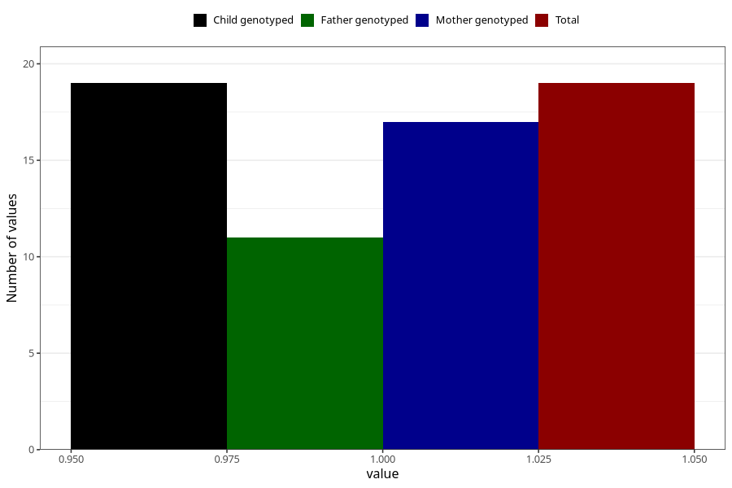

# hospitalized_threatening_preterm_labour_17_20w
Variable mapping to `CC169` in `Skjema3_v12`.
- Number of values:

| Value | Total | Child genotyped | Mother genotyped | Father genotyped |
| ----- | ----- | --------------- | ---------------- | ---------------- |
| Missing | 80986 | 80986 | 76600 | 53593 |
| Non-missing | 19 | 19 | 17 | 11 |
| 1 | 19 | 19 | 17 | 11 |

